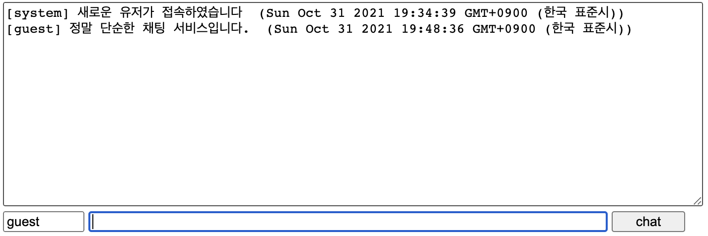
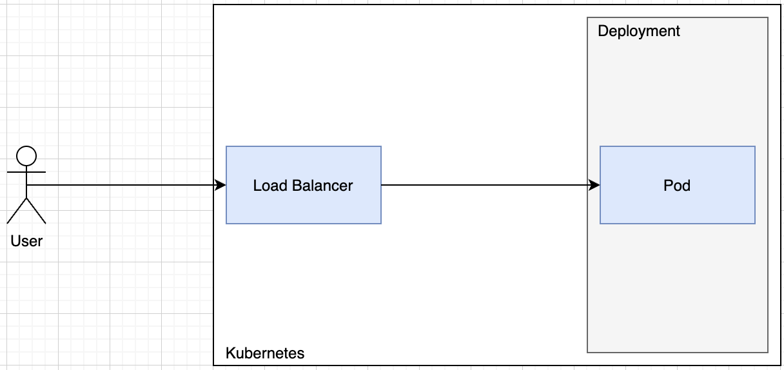
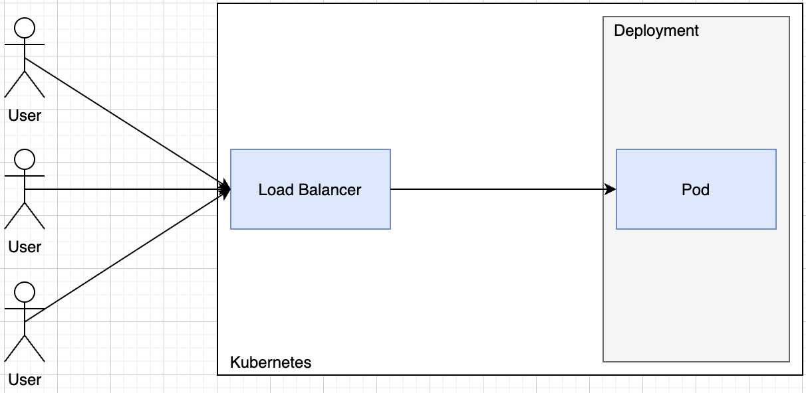
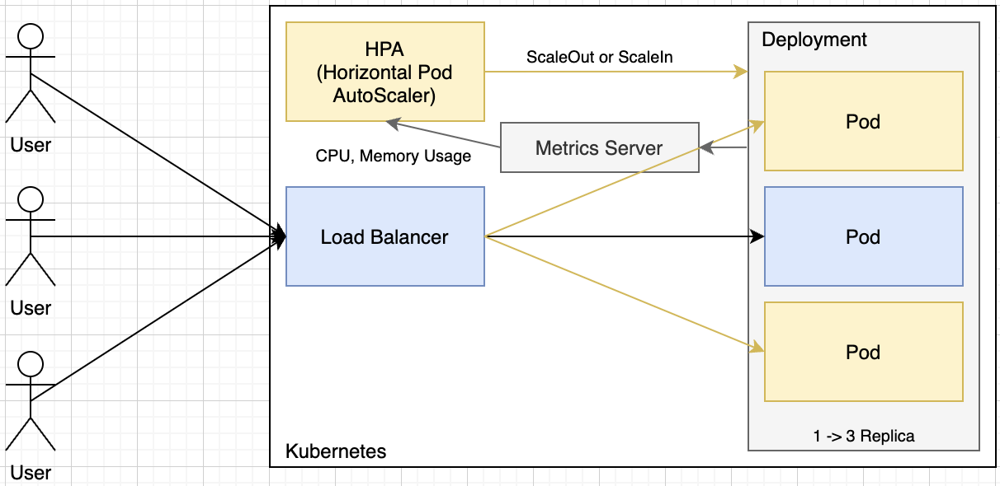

# Sample Project 설명



정말 단순한 채팅 서비스를 Auto Scaling의 예제로 사용해 볼 것입니다.

## Configuration & Setup

### Project Cloning

```sh
git clone https://github.com/rhea-so/K3sAutoScaling
cd K3sAutoScaling
npm i
```

### Build 

```sh
tsc
```

### Run

```sh
node dist/index.js --env=local
```

## Kubernetes Architecture





## Goal



### Artillery

```sh
artillery quick --duration 300 --rate 10 -n 20 http://192.168.0.36:3000/test.html
```

오토스케일링이 어떻게 이루어지는지 대략적인 계산은 다음처럼 이뤄집니다.

```javascript
TargetNumOfPods = ceil(sum(CurrentPodsCPUUtilization) / Target)
```

> [What is Mili CPU?](https://stackoverflow.com/questions/53255956/what-is-the-meaning-of-cpu-and-core-in-kubernetes)

오토스케일링이 이뤄질때의 기준이 되는 자원 사용량은 현재 시점의 데이터만을 사용합니다.  
그러다 보니 오토스케일링이 이뤄지고 나서 실제로 포드가 늘어나고 있긴 하지만 아직 포드가 실행되고 있는 도중에 다시 오토스케일링을 통해서 포드를 늘리라는 요청이 발생할 수도 있습니다.  
그래서 일단 한번 오토스케일링이 일어나면 일정시간동안은 추가로 오토스케일링이 일어나지 않게 쿨다운 시간을 둘 수 있습니다.  
포드가 늘어날때의 기본 쿨다운 시간은 3분이고 `--horizontal-pod-autoscaler-downscale-delay` 옵션을 통해 조정할 수 있습니다.  
포드가 줄어들때의 기본 쿨다운 시간은 5분이고 `--horizontal-pod-autoscaler-downscale-delay` 옵션을 통해 조정할 수 있습니다.

> [https://arisu1000.tistory.com/27858](https://arisu1000.tistory.com/27858)  
> [https://medium.com/dtevangelist/k8s-kubernetes%EC%9D%98-hpa%EB%A5%BC-%ED%99%9C%EC%9A%A9%ED%95%9C-%EC%98%A4%ED%86%A0%EC%8A%A4%EC%BC%80%EC%9D%BC%EB%A7%81-auto-scaling-2fc6aca61c26](https://medium.com/dtevangelist/k8s-kubernetes%EC%9D%98-hpa%EB%A5%BC-%ED%99%9C%EC%9A%A9%ED%95%9C-%EC%98%A4%ED%86%A0%EC%8A%A4%EC%BC%80%EC%9D%BC%EB%A7%81-auto-scaling-2fc6aca61c26)
