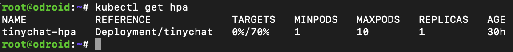
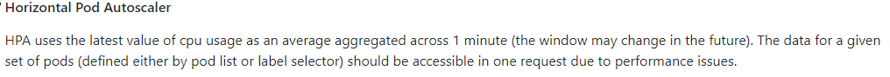
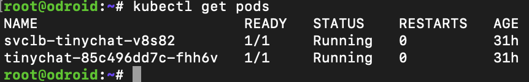
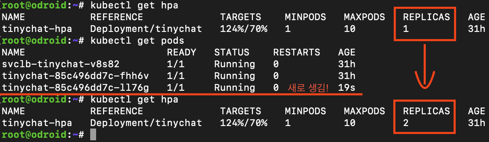
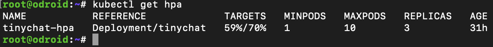
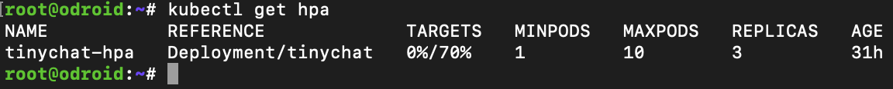
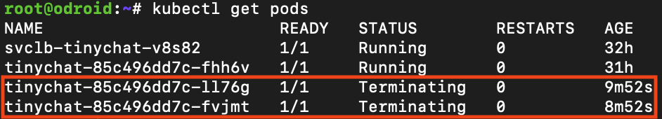
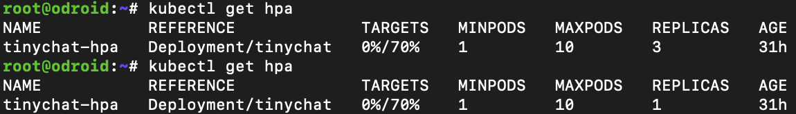

# Sample Project 설명


Socket.io와 Express를 사용해 만든 채팅 서비스를 Auto Scaling 해봅시다.  

```
http://localhost:3000
```

위 주소로 접속하면, 채팅 페이지에 접속합니다.  
이후, 접속한 유저들끼리 메시지를 주고 받을 수 있습니다.

## 사전 준비

* Docker
* K3s
  * [k3s 시리즈 - 간단하게 Kubernetes 환경 구축하기](https://si.mpli.st/dev/2020-01-01-easy-k8s-with-k3s/)
* NodeJS

## Project Configuration

```sh
git clone https://github.com/rhea-so/K3sAutoScaling
cd K3sAutoScaling

npm i

tsc

node dist/index.js --env=local
```

위 명령어로 간단하게 서버를 켤 수 있습니다.


```
http://localhost:60001
```

위 주소로 서버에 접속하면 채팅 페이지가 나타납니다.

```sh
./script/start.sh # ① Docker Build -> ② Kubernetes Apply yaml -> ③ Service Open!

./script/stop.sh # ① Kubernetes Apply yaml -> ② Remove Docker Image (Force)
```

위 명령어로 Kubernetes에 띄울 수 있습니다.

## Kubernetes Architecture


Project Configuration을 마치면 위와 같은 모습이 됩니다.  
User의 모든 요청은 Load Balancer Service로 전달, → 이후 서버 Pod로 전달됩니다.

> 여기서 서버 Pod에 NodeJS 채팅 서버가 띄워져있습니다.


서비스가 대박이 나서 유저가 몰리면 어떻게 될까요?

서버 Pod는 버티지 못하고 죽어버리기 전에 빨리 추가 서버 Pod를 띄워야 합니다.

누가 띄울 수 있을까요?

Load Balancer? Deployments?


이럴때 사용하는게 Horizontal Pod Autoscaler. 줄여서 HPA입니다.

이름 그대로 Pod를 수평 확장 해주는 기능을 합니다.

```sh
kubectl get hpa
```



위 명령어로 등록되어있는 HPA를 조회할 수 있습니다.

HPA를 조회했을때 나오는 값들의 설명은 아래와 같습니다.

* TARGETS(~%/~%): 대상 Deployment의 총 사용량 / AutoScaling을 할 사용량
  * 예) 50% / 40% 인 경우 Pod를 1개 생성합니다.
  * 예) 50% / 20% 인 경우 Pod를 2개 생성합니다.
  * TARGETS 정보는 Metrics Server로부터 가져옵니다.
  * 간혹 Metrics Server로부터 값을 가져오지 못해 \<UNKNOWN\> 으로 표시되는 경우가 있는데, 이 경우 이 [링크](https://github.com/kubernetes/minikube/issues/4456#issuecomment-569588906)를 따라서 조치해주시면 됩니다.
  * 
  * [Metrics API Design](https://github.com/kubernetes/community/blob/master/contributors/design-proposals/instrumentation/resource-metrics-api.md)에 의하면, Metrics Server로부터 값을 매 1분마다 가져온다고 합니다.
* MINPODS: 항상 지켜져야 하는 최소 Pod의 수
* MAXPODS: 생성 가능한 최대 Pod의 수
* REPLICAS: 현재 생성된 Pod의 수는 얼마나 되는가?
* AGE: HPA가 실행되고부터 얼마나 많은 시간이 흘렀는지?

## How to make HPA?

```yaml
apiVersion: autoscaling/v2beta1
kind: HorizontalPodAutoscaler
metadata:
    name: tinychat-hpa # HPA의 이름
    labels:
        app: tinychat-hpa # HPA의 이름
spec:
    minReplicas: 1 # 최소 Pod 수
    maxReplicas: 10 # 최대 Pod 수

    # Scale 할 조건
    metrics:
    - resource:
        name: cpu # Memory도 사용할 수 있습니다.
        targetAverageUtilization: 70 # Deployment의 총 CPU 사용량이 70%를 넘어설때마다, ScaleOut을 합니다.
      type: Resource

    # Scale 할 ReplicaSet 설정
    scaleTargetRef:
        apiVersion: apps/v1
        kind: Deployment
        name: tinychat # Deployment의 이름
```

## CPU 사용량 계산 방법

```yaml
resources:
    requests:
        cpu: "500m" # CPU 1코어를 절반만 요구!
    limits:
        cpu: "1000m" # CPU 1코어를 전부 요구!
```

Kubernetes에서는 Mili 방식으로 CPU 사용량을 설정합니다.

> [What is Mili CPU?](https://stackoverflow.com/questions/53255956/what-is-the-meaning-of-cpu-and-core-in-kubernetes)

위 예시에서는 기본적으로 Pod를 띄울때 `500m`을 요구합니다.

```javascript
TargetNumOfPods = ceil(sum(CurrentPodsCPUUtilization) / Target)
```

Auto Scaling 공식은 위와 같습니다.

targetAverageUtilization 50%라면, 이는 `500m`의 절반인 `250m`을 나타냅니다.  

전체 Pod의 총 CPU 사용량의 평균이 `250m`을 넘기게 되면, ScaleOut을 합니다.

반대로, 평균이 감소되면 ScaleIn을 합니다.

## Auto Scaling을 두 눈으로 보기

### Artillery로 부하 주기

```sh
artillery quick --duration 300 --rate 10 -n 20 http://192.168.0.36:3000/test.html
```

### 부하 주기 전



부하를 주기 전 상황입니다!

서버 Pod 1개, Load Balancer 1개가 띄워져있습니다.


서버에 아무 요청을 보내지 않았기 때문에, 굉장히 평온한 상태를 유지하고 있습니다.

### 부하 주는 중



부하로 인해 ScaleOut 되는 모습을 볼 수 있습니다.



Pod를 2개 더 띄워서 targetAverageUtilization에 맞춘 모습을 볼 수 있습니다.

이제 더 이상 Pod가 생겨나진 않습니다.

지금 주고 있는 부하로는 3개의 Pod로 충분히 처리할 수 있는 모양입니다.

### 부하가 끝난 후



CPU 사용량이 0%가 되었습니다.



좀 기다리니, 불필요한 Pod 2개를 제거를 하기 시작합니다.



ScaleIn이 끝나고 Pod는 1개가 되었습니다.

## Auto Scaling시 Pod가 생성 or 제거될때 딜레이가 있어요

오토스케일링이 이뤄질때의 기준이 되는 자원 사용량은 현재 시점의 데이터만을 사용합니다.  

그러다 보니 오토스케일링이 이뤄지고 나서 실제로 포드가 늘어나고 있긴 하지만,  
아직 포드가 실행되고 있는 도중에 다시 오토스케일링을 통해서 포드를 늘리라는 요청이 발생할 수도 있습니다.  

그래서 일단 한번 오토스케일링이 일어나면 일정 시간 동안은 추가로 오토스케일링이 일어나지 않게 쿨다운 시간을 둡니다.

포드가 늘어날때의 기본 쿨다운 시간은 3분이고 `--horizontal-pod-autoscaler-downscale-delay` 옵션을 통해 조정할 수 있습니다.  
포드가 줄어들때의 기본 쿨다운 시간은 5분이고 `--horizontal-pod-autoscaler-downscale-delay` 옵션을 통해 조정할 수 있습니다.

## Reference

* [https://arisu1000.tistory.com/27858](https://arisu1000.tistory.com/27858)  
* [https://medium.com/dtevangelist/k8s-kubernetes%EC%9D%98-hpa%EB%A5%BC-%ED%99%9C%EC%9A%A9%ED%95%9C-%EC%98%A4%ED%86%A0%EC%8A%A4%EC%BC%80%EC%9D%BC%EB%A7%81-auto-scaling-2fc6aca61c26](https://medium.com/dtevangelist/k8s-kubernetes%EC%9D%98-hpa%EB%A5%BC-%ED%99%9C%EC%9A%A9%ED%95%9C-%EC%98%A4%ED%86%A0%EC%8A%A4%EC%BC%80%EC%9D%BC%EB%A7%81-auto-scaling-2fc6aca61c26)

## 결론

Kubernetes 환경에서 CPU 사용량을 바탕으로 Auto Scaling 하는 방법에 대해서 배워보았습니다.

여러분들도 토이 프로젝트 만들고 배포할때 등등..  
HPA 하나만 신경써보셔서, 서버 비용도 줄이고 부하에도 대응 할 수 있다는 이점을 누려보세요.

> 아 잠 잘때 서버 확장 안해도 되서 너무 편하고 좋다 ~  
> 괜히 많은 회사들이 Production에서 사용하는게 아님 ㄹㅇ
