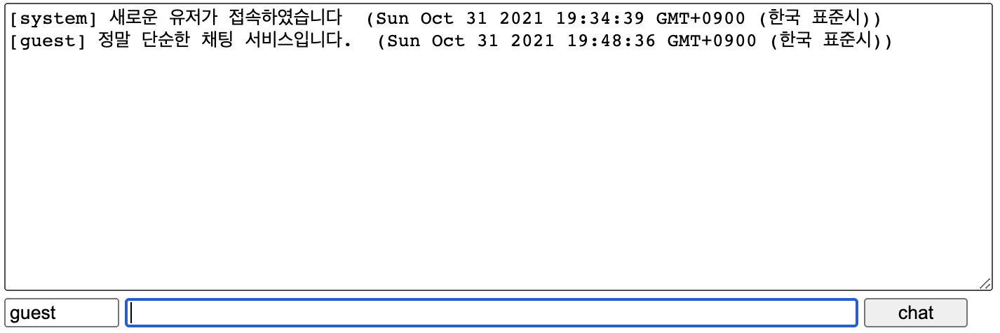
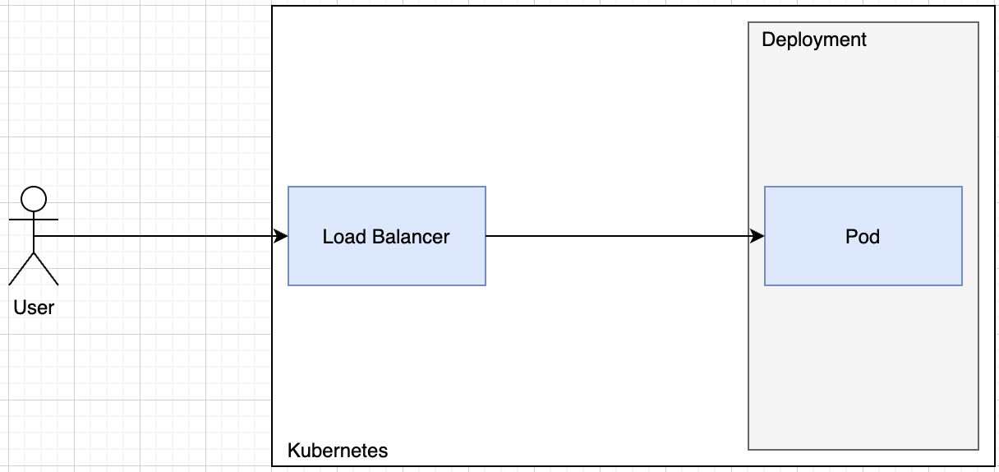
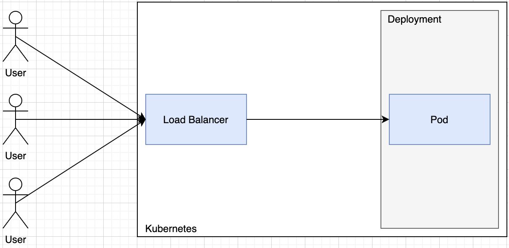
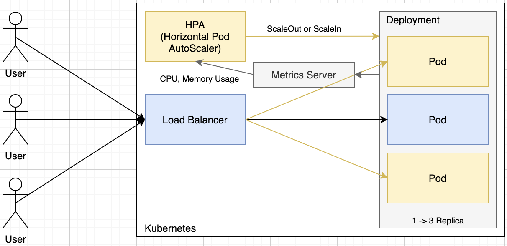

# Sample Project 설명



정말 단순한 채팅 서비스를 Auto Scaling의 예제로 사용해 볼 것입니다.

## Configuration & Setup

### Project Cloning

```sh
git clone https://github.com/rhea-so/K3sAutoScaling
cd K3sAutoScaling
npm i
```

### Build 

```sh
tsc
```

### Run

```sh
node dist/index.js --env=local
```

## Kubernetes Architecture





## Goal


